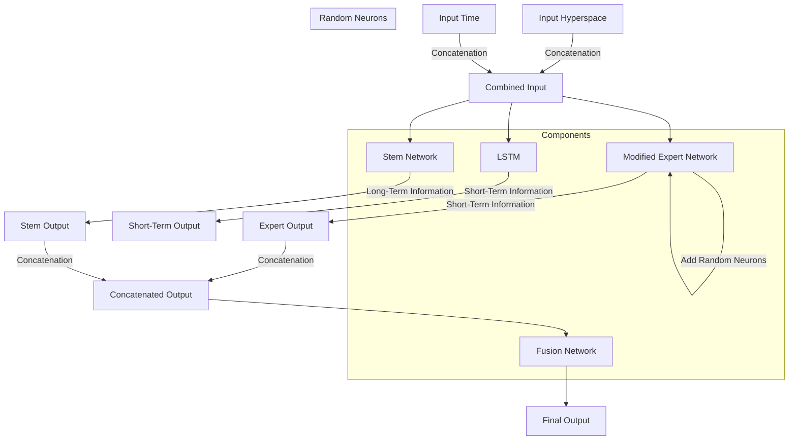

```mermaid
    graph TD
        A[Input Hyperspace] --> |Concatenation| B[Combined Input]
        T[Input Time] --> |Concatenation| B[Combined Input]
        
        B[Combined Input] --> C[LSTM]
        B[Combined Input] --> D[Expert Network]
        B[Combined Input] --> E[Stem Network]

        C[LSTM] --> |Short-Term Information| F[Short-Term Output]
        D[Expert Network] --> |Short-Term Information| G[Expert Output]
        E[Stem Network] --> |Long-Term Information| H[Stem Output]

        G[Expert Output] --> |Concatenation| I[Concatenated Output]
        H[Stem Output] --> |Concatenation| I[Concatenated Output]
        
        I[Concatenated Output] --> J[Fusion Network]
        
        J[Fusion Network] --> K[Final Output]
        
        subgraph Components
            C[LSTM]
            D[Expert Network]
            E[Stem Network]
            J[Fusion Network]
        end

        subgraph Random Neurons
            direction TB
            D[Expert Network] --> |Add Random Neurons| D[Modified Expert Network]
        end
```